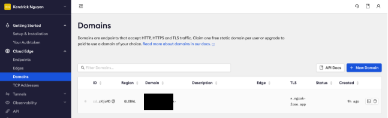
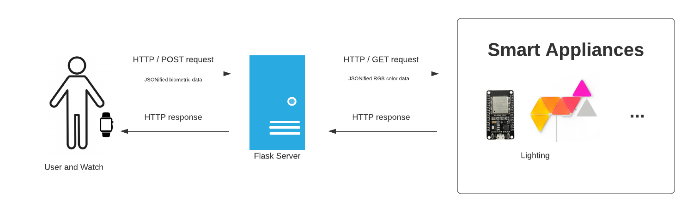

<!------------------------------------------ TITLE BLOCK --------------------------------------------------------------->
<h1 align="center"> MoodMesh </h1>

<p align="center">
    CSE 118 Team I
    <br /> <br />
    <a href="https://github.com/friidryce"> Jason Au </a>
    ·
    <a href="https://github.com/cstarrynight"> Christina Mai </a>
    ·
    <a href="https://github.com/kendrick010"> Kendrick Nguyen </a>
</p>


<!------------------------------------------ TABLE OF CONTENTS ---------------------------------------------------------->
<details open="open">
  <summary><h2 style="display: inline-block"> Table of Contents </h2></summary>
  <ol>
    <li>
      <a href="#about-the-project"> About The Project </a>
      <ul>
        <li><a href="#built-with"> Built With </a></li>
      </ul>
    </li>
    <li>
      <a href="#getting-started"> Getting Started </a>
      <ul>
        <li><a href="#prerequisites"> Prerequisites </a></li>
        <li><a href="#project-installation"> Project Installation </a></li>
        <li><a href="#how-to-run"> How to Run </a></li>
      </ul>
    </li>
    <li><a href="#network-architecture"> Network Architecture </a></li>
    <li><a href="#file-architecture"> File Architecture </a></li>
  </ol>
</details>


<!------------------------------------------ About The Project ---------------------------------------------------------->
## About The Project

A problem statement our project seeks to address is how environmental factors can impact mental health. We often spend time in places, such as home, work, school, etc., that have notable “environmental factors”, such as aesthetics, lighting, sound, people, etc. These ambient factors can psychologically affect our mental wellness; for instance, raising stress levels or induce symptoms from specific sensory sensitivities. Although this problem statement can apply to a general population, it mainly prioritizes people with mental health issues, such as depression and loneliness. 

To address the issue of the lack of awareness on how improvements in environmental factors could affect one’s mental health, our project is geared towards creating a wearable device and application that dynamically adjusts and monitors environmental factors, such as lighting, based on biometric data from heart rate stress levels, etc.

### Built With
- Galaxy Smart Watch
- Raspberry Pi
- Python
- Flask
- ESP32
- PlatformIO
- ngrok

<!------------------------------------------ Getting Started ---------------------------------------------------------->
## Getting Started

To get a local copy up and running follow these steps.

### Prerequisites

This project will be running on a Raspberry Pi. Set up your Raspberry Pi by installing the Raspberry Pi OS. If you are comfortable with using Linux, I recommend downloading the Raspberry Pi OS Lite version. Here is a [complete guide for installing the OS](https://projects.raspberrypi.org/en/projects/raspberry-pi-setting-up).

Make sure you have the latest version of `Python 3.11.*` on your Raspberry Pi. 

For our wearable app, development and installation was done on [Android Studio](https://developer.android.com/studio) on a personal machine.

An optional portion of this project was designing and fabricating a smart light appliance. We prototyped a nano leaf, and the design files and BOM will be listed [here](esp32_nanoleaf/README.md). The nano leaf is an IoT device, which requires embedded firmware for the ESP32 housed inside. Therefore, we recommend using [Visual Studio Code](https://code.visualstudio.com/) with the [PlatformIO](https://platformio.org/) extension for development.

Lastly, this project is persistently communicating with different devices, among the watch, server, and smart appliance. Our main method of communication is with REST APIs via HTTP requests. To make our device/server network endpoints public yet secure for communication, we require a tool [nrgok](https://ngrok.com/) on the Raspberry Pi. Feel free to use the free trial!

### Smart Appliance-Installation

1. Build the nano leaf as outlined [here](smart_devices/README.md).

2. Clone the repo on your personal machine
```bash
git clone https://github.com/friidryce/UCSD-CSE-118-218-Team-I
```

3. On [Visual Studio Code](https://code.visualstudio.com/), open a [PlatformIO](https://platformio.org/) project using the `esp32_nanoleaf/firmware` folder.

4. In the `esp32_nanoleaf/firmware/include` folder, create a `secrets.h` header file containing your WiFi credentials. This must be the same network that the Raspberry Pi is on. Example,
```c
// Wifi credentials
const char* ucsdSSID = "UCSD-Guest";
const char* ucsdPassword = "";
```

5. Upload the code `src` code to the ESP32. [PlatformIO](https://platformio.org/) offers convenient features, such as port detection, larger boards selection, pre-loaded libraries, and all other features offered already in VSCode, that makes embedded development easy.

6. Open the Serial Monitor and wait for a successful WiFi connection. Once connected, the Serial Monitor will print the local IP address of the ESP32. Copy/save this for later.

### Ngrok Installation

1. If you have not, create an [nrgok](https://ngrok.com/) account.

2. For convenience, we can obtain a static forwarding URL by creating a domain. Proceed with this step and copy/save the domain URL.



3. Copy/save your `authtoken` on the dashboard page as well.

### Server-Side Installation

1. Clone the repo on the Raspberry Pi
```bash
git clone https://github.com/friidryce/UCSD-CSE-118-218-Team-I
```

2. Install the latest version of `Flask`, `python-dotenv`, `nrgok` Python SDK, and `numpy` or alternatively if you have `pip`, run
```bash
pip install -r requirements.txt
```

3. Create an `.env` file in the root directory of the repository. Add the following environment variables, `NGROK_AUTH` and `NGROK_DOMAIN`, appropriately.
```bash
NGROK_AUTH=XXXXXXXXXXXXXXX
NGROK_DOMAIN=XXXXXXXXXXXXXXX
``` 

4. In the `main.py` script, modify the `ESP32` constant appropriately to the local IP address of the ESP32 board.

### Android-App Installation
#### Samsung Galaxy Watch Setup
1. Enable Developer Options on Galaxy Watch
    - Open Settings > About Watch > Software Information > Tap (at least 5 times) "Software Version" until the watch says "Developer mode turned on" 

2. Enable WiFi debugging on Galaxy Watch
  - Open Developer Options > Enable "ADB Debugging"
  - Enable "Wireless debugging"
  - Click "Pair new device"
  - Note IP Address and port & Pairing Code of watch
  - Keep the watch on this screen as you proceed to the next step

  #### Computer Side Setup
  ##### Option 1: Using Android Studio SDK
  1. Open the "CSE118_FinalProject" folder in Android Studio
  2. Top right corner, click the dropdown menu next to the play button
  3. In the dropdown menu, select "Pair Devices using WiFi"
  4. Go to tab that says "Pair using pairing code"
  5. Enter WiFi pairing code from step 2 of Galaxy Watch setup
  ##### Option 2: Using ADB CLI
  1. Download the Android SDK Platform Tools from [here](https://developer.android.com/studio/releases/platform-tools)
  2. Copy the apk file of the app (app_install/apk-debug) into the platform-tools folder from Option2: step 1
  3. open the platforms-tools folder in the terminal and run the following commands:
      - `./adb pair <IP Address of Galaxy Watch>:<Port Number>`
      - Enter WiFi pairing code from step 2 of Galaxy Watch setup
      - `./adb install apk-debug.apk`


### How to Run

Run `python main.py`.

Monitor the watch and nanoleaf for color changes! If you do not have a Galaxy Watch, you can simulate sending biometric data to the server using the `server/test/spoof_data.py` script.

> [!Warning]  
> Ensure that the Raspberry Pi and ESP32/Nano Leaf are on the same WiFi network before starting a ngrok session using `main.py`.

<!------------------------------------------ Network Architecture  ---------------------------------------------------------->
## Network Architecture



<!------------------------------------------ File Architecture  ---------------------------------------------------------->
## File Architecture
```
[UCSD-CSE-118-218-Team-I]
├─ 📂.github/workflows
├─ 📂CSE118_FinalProject
  ├─ 📂app
    ├─ 📂src/main
      ├─ 📂java/com/example/cse118_finalproject
        ├─ 📄MainActivity.java
      ├─ 📂...
      ├─ 📄...
    ├─ 📄build.gradle
    ├─ 📄...
  ├─ 📂...
  ├─ 📄...
├─ 📂esp32_nanoleaf
  ├─ 📂firmware
    ├─ 📂include
      ├─ 📄secrets.h
    ├─ 📂src
      ├─ main.cpp
    ├─ 📂...
    ├─ 📄platformio.ini
  ├─ 📂hardware
    ├─ 📂...
    ├─ 📄...
  ├─ 📄README.md
├─ 📂server
  ├─ 📂test
    ├─ 📄...
  ├─ 📄app.py
├─ 📄.gitignore
├─ 📄README.md
├─ 📄main.py
├─ 📄requirements.txt
```

