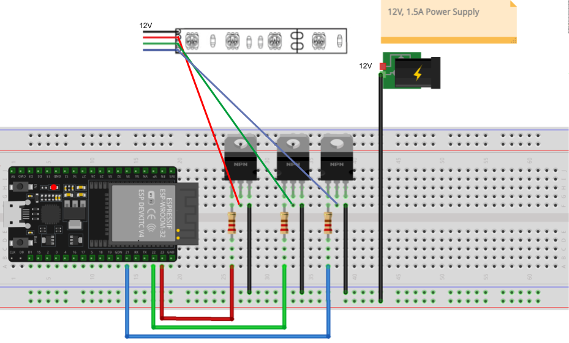

# Smart Appliance: Nano Leaf

Redacted from [Envision's DIY Nanoleaf](https://sites.google.com/ucsd.edu/envisionhub/project-library/advanced-projects/diy-nanoleaf?authuser=0)

## Getting Started

For our smart appliance, we modified [Envision's DIY Nanoleaf](https://sites.google.com/ucsd.edu/envisionhub/project-library/advanced-projects/diy-nanoleaf?authuser=0) by adding an ESP32 to control the LEDs and to persistently communicate with the `Flask` server. 

The same design was used but with the addition with a custom permanent back panel (`esp32_nanoleaf/hardware/laser cut panels/back_panel.svg`) and the schematic below.

## Demo

